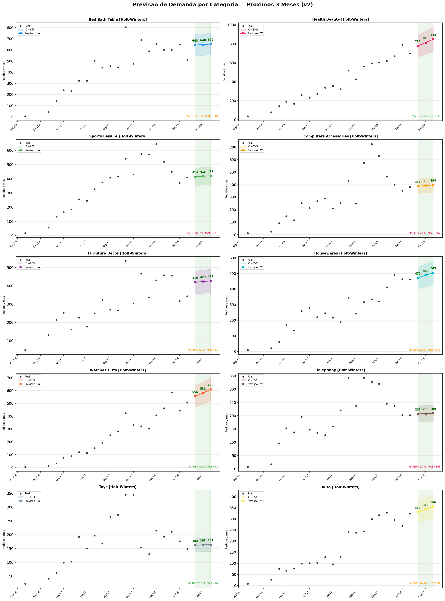
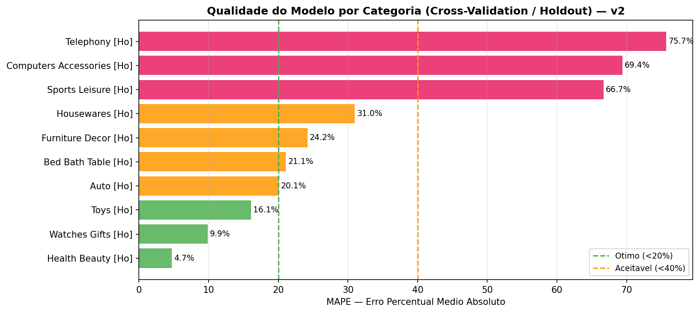
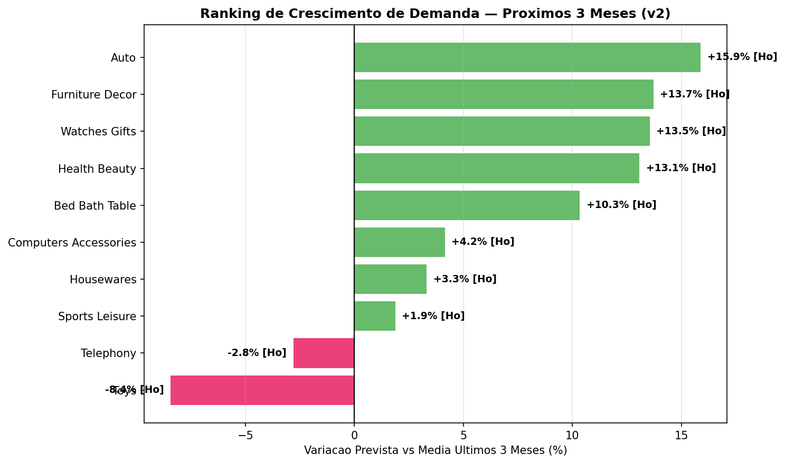
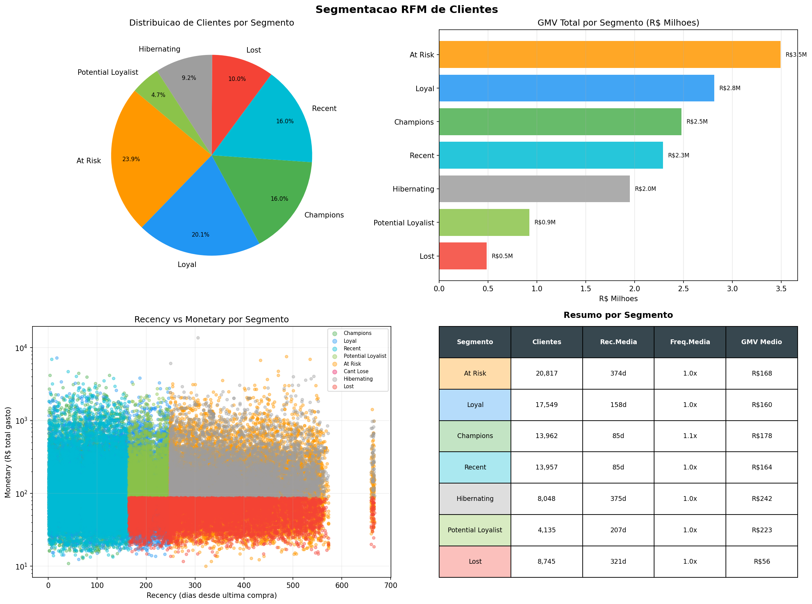
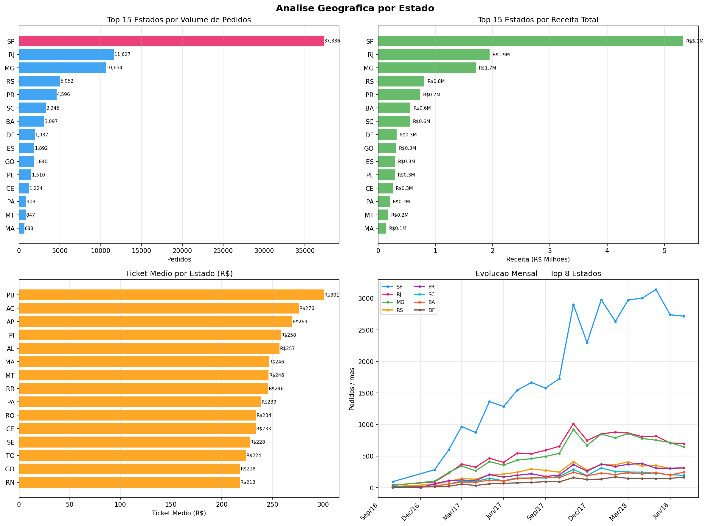

# Olist E-commerce — Análise de Demanda & Segmentação de Clientes

Pipeline completo de análise de dados sobre o dataset público da **Olist** (marketplace brasileiro), cobrindo forecast de demanda, segmentação RFM de clientes e análise geográfica.

---

## Problema de negócio

| Pergunta | Módulo |
|---|---|
| Quanto vou vender nos próximos 3 meses por categoria? | Forecast de demanda |
| Quais clientes estão em risco de churn? | Segmentação RFM |
| Onde vale investir em logística e marketing? | Análise por estado |

---

## Resultados

### Forecast de demanda (MAPE por categoria)
| Categoria | MAPE | Qualidade |
|---|---|---|
| Health Beauty | 4.7% | Ótimo |
| Watches & Gifts | 9.9% | Ótimo |
| Toys | 16.1% | Ótimo |
| Auto | 20.1% | Aceitável |
| Bed Bath Table | 21.1% | Aceitável |
| Furniture Decor | 24.2% | Aceitável |
| Housewares | 31.0% | Aceitável |

### Gráficos gerados







---

## Stack

- **Python 3.12**
- **Prophet** — forecast de série temporal com feriados brasileiros
- **Statsmodels** — Holt-Winters (ETS) como modelo fallback
- **Pandas / NumPy** — manipulação de dados
- **Matplotlib** — visualizações

---

## Como executar

### 1. Clone o repositório
```bash
git clone https://github.com/felipeeduardor/-olist-demand-forecast.git
cd -olist-demand-forecast
```

### 2. Instale as dependências
```bash
pip install pandas numpy matplotlib prophet statsmodels
```

### 3. Baixe o dataset
Acesse o dataset público da Olist no Kaggle:
[Brazilian E-Commerce Public Dataset by Olist](https://www.kaggle.com/datasets/olistbr/brazilian-ecommerce)

Extraia todos os CSVs na raiz do projeto.

### 4. Execute os scripts
```bash
# Análise de demanda + forecast
python forecast_demanda.py

# Análise geográfica + receita + RFM
python analise_avancada.py
```

Os outputs são gerados em `forecast_output/`.

---

## Estrutura do projeto

```
├── forecast_demanda.py       # EDA, decomposição, forecast de demanda por categoria
├── analise_avancada.py       # Análise por estado, forecast de receita, RFM
├── forecast_output/
│   ├── 01_eda_geral.png
│   ├── 02_evolucao_categorias.png
│   ├── 03_decomposicao.png
│   ├── 04_forecast_categorias.png
│   ├── 05_metricas_modelo.png
│   ├── 06_ranking_crescimento.png
│   ├── 07_analise_estados.png
│   ├── 08_forecast_receita.png
│   └── 09_rfm_segmentacao.png
└── README.md
```

---

## Dataset

- **Fonte:** [Olist — Kaggle](https://www.kaggle.com/datasets/olistbr/brazilian-ecommerce)
- **Período:** Outubro/2016 a Julho/2018
- **Volume:** 90.000+ pedidos entregues · 71 categorias · 27 estados
